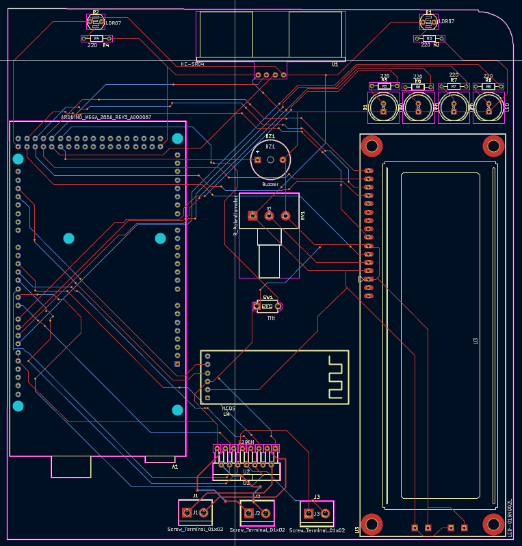
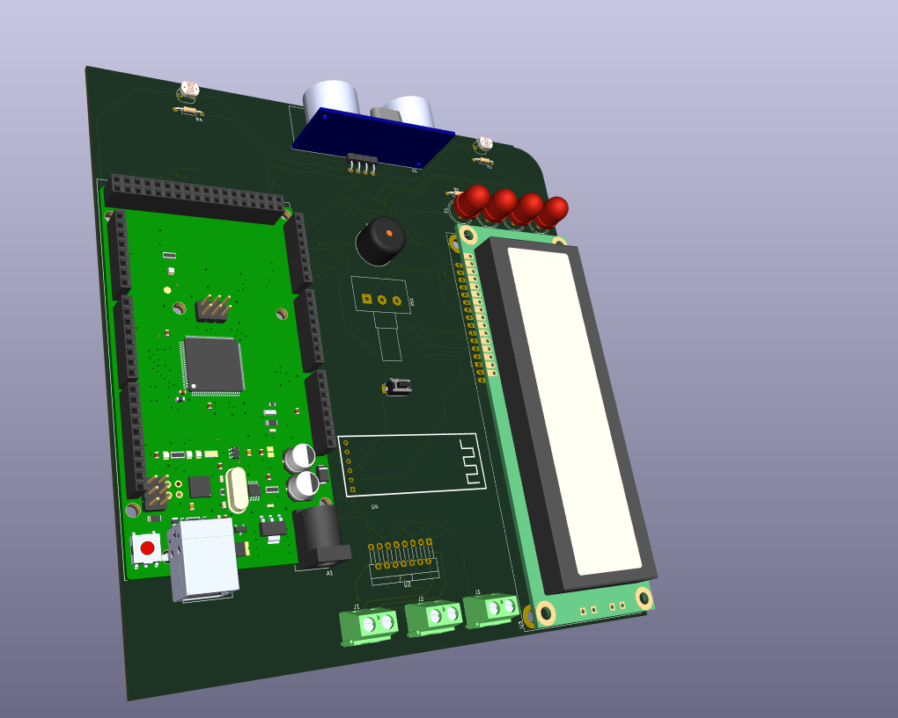

# 🚀 SpectroDrive – Smart Light Following Robot

SpectroDrive is a multi-functional embedded robotics project integrating sensing, control, and wireless communication into a compact system.

---

## 🎯 Project Overview

This robot is capable of:

* Tracking and following light sources
* Performing interactive LED-based behaviors
* Detecting external disturbances (tilt)
* Securing itself with a password-based system
* Being controlled wirelessly via Bluetooth

---

## ⚙️ System Features

* 🔆 Light Following Mode
* 👋 Greeting Mode (LED animation)
* 🚨 Tilt-based Security System
* 🔐 Dual-stage password protection
* 📡 Bluetooth Control (HC-05)
* 📟 LCD Interface
* 🔊 Buzzer Alert System

---

## 🧩 Project Structure

```text
Firmware/
 └── Arduino/
      └── Spectrodrive.ino

Software/
 └── MobileApp/apk/
      └── Spectrodrive.apk

hardware/
 ├── BOM/
 ├── PCB/
 ├── schematic/
 └── images/
```

---

## 🔧 Hardware

Full hardware design including schematic, PCB, and BOM:

👉 [Hardware Documentation](hardware/README.md)

---

## ⚙️ Firmware

Arduino-based embedded control system:

👉 [Firmware Files](Firmware/Arduino/)

---

## 📱 Mobile Application

Bluetooth-based control interface:

👉 [Mobile App](Software/MobileApp/)

---

## 📸 Preview

### PCB Design



### 3D View



---

## 🛠️ Technologies

* KiCad (PCB & schematic)
* Arduino (Embedded control)
* UART / ADC / GPIO
* Bluetooth (HC-05)

---

## 🎯 Purpose

Developed to gain hands-on experience in:

* Embedded systems
* PCB design
* Robotics integration
* Real-time control systems

---

## 🚀 Future Improvements

* Mobile UI enhancements
* Autonomous navigation
* Advanced control algorithms
* IoT integration

---

## 📌 Author

Electrical & Electronics Engineering student focused on embedded systems and robotics.
